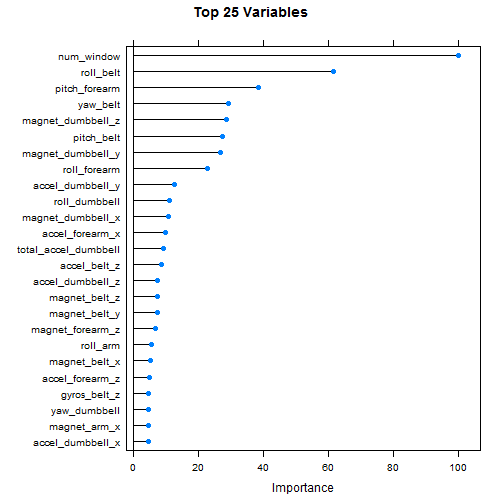
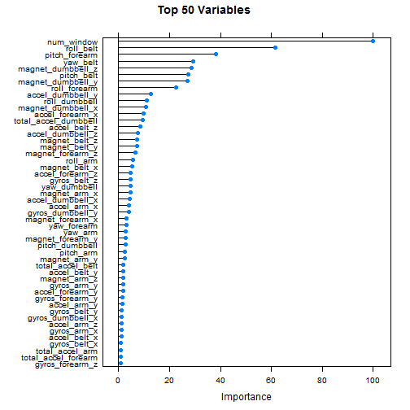

### Introduction

Using devices such as _Jawbone Up_, _Nike FuelBand_, and _Fitbit_ it is now possible to collect a large amount of data about personal activity relatively inexpensively. These type of devices are part of the quantified self movement - a group of enthusiasts who take measurements about themselves regularly to improve their health, to find patterns in their behavior, or because they are tech geeks. One thing that people regularly do is quantify how much of a particular activity they do, but they rarely quantify how well they do it. In this project, your goal will be to use data from accelerometers on the belt, forearm, arm, and dumbell of 6 participants. They were asked to perform barbell lifts correctly and incorrectly in 5 different ways. More information is available from the website here: http://groupware.les.inf.puc-rio.br/har (see the section on the Weight Lifting Exercise Dataset).

#### The Prompt

You should:
1. Create a report describing how you built your model, 
2. How you used cross validation, 
3. What you think the expected out of sample error is, 
4. Why you made the choices you did.


#### Data

The training data for this project are available here:

https://d396qusza40orc.cloudfront.net/predmachlearn/pml-training.csv

The test data are available here:

https://d396qusza40orc.cloudfront.net/predmachlearn/pml-testing.csv

The data for this project come from this source: http://groupware.les.inf.puc-rio.br/har. If you use the document you create for this class for any purpose please cite them as they have been very generous in allowing their data to be used for this kind of assignment.


#### Packages

For this project we will be using a series of packages to test and cross validate our data. The following packages are needed to be loaded in before the actual analysis can take place. 


```r
library(ggplot2)
library(caret)
library(e1071)
library(gbm)
library(survival)
library(splines)
library(plyr)
```


#### Load the Data

Read the data and load it into R. Personally, I pre-downloaded the file and placed it into my working directory. Next, we will rename all of the missing data (`#DIV/0!`) with `NA`.


```r
training <- read.csv("C:/Machine Learning/pml-training.csv", na.strings=c("#DIV/0!"), row.names = 1)
testing <- read.csv("C:/Machine Learning/pml-testing.csv", na.strings=c("#DIV/0!"), row.names = 1)
```

Next, we want to further clean our data. We partition the training set (we seperate the set into _Training_ and _Validation_) so we can validate our model. 


```r
training <- training[, 6:dim(training)[2]]

treshold <- dim(training)[1] * 0.95

goodColumns <- !apply(training, 2, function(x) sum(is.na(x)) > treshold  || sum(x=="") > treshold)

training <- training[, goodColumns]

badColumns <- nearZeroVar(training, saveMetrics = TRUE)

training <- training[, badColumns$nzv==FALSE]

training$classe = factor(training$classe)

inTrain <- createDataPartition(training$classe, p = 0.6)[[1]]
crossv <- training[-inTrain,]
training <- training[ inTrain,]
inTrain <- createDataPartition(crossv$classe, p = 0.75)[[1]]
crossv_test <- crossv[ -inTrain,]
crossv <- crossv[inTrain,]


testing <- testing[, 6:dim(testing)[2]]
testing <- testing[, goodColumns]
testing$classe <- NA
testing <- testing[, badColumns$nzv==FALSE]
```


```r
mod1 <- train(classe ~ ., data=training, method="rf")

pred1 <- predict(mod1, crossv)
```


```r
confusionMatrix(pred1, crossv$classe)
```

```
## Confusion Matrix and Statistics
## 
##           Reference
## Prediction    A    B    C    D    E
##          A 1674    1    0    0    0
##          B    0 1137    3    0    0
##          C    0    1 1023    3    0
##          D    0    0    0  962    6
##          E    0    0    0    0 1076
## 
## Overall Statistics
##                                          
##                Accuracy : 0.9976         
##                  95% CI : (0.996, 0.9987)
##     No Information Rate : 0.2844         
##     P-Value [Acc > NIR] : < 2.2e-16      
##                                          
##                   Kappa : 0.997          
##  Mcnemar's Test P-Value : NA             
## 
## Statistics by Class:
## 
##                      Class: A Class: B Class: C Class: D Class: E
## Sensitivity            1.0000   0.9982   0.9971   0.9969   0.9945
## Specificity            0.9998   0.9994   0.9992   0.9988   1.0000
## Pos Pred Value         0.9994   0.9974   0.9961   0.9938   1.0000
## Neg Pred Value         1.0000   0.9996   0.9994   0.9994   0.9988
## Prevalence             0.2844   0.1935   0.1743   0.1639   0.1838
## Detection Rate         0.2844   0.1932   0.1738   0.1634   0.1828
## Detection Prevalence   0.2846   0.1937   0.1745   0.1645   0.1828
## Balanced Accuracy      0.9999   0.9988   0.9981   0.9978   0.9972
```


```r
pred1 <- predict(mod1, crossv_test)

accuracy <- sum(pred1 == crossv_test$classe) / length(pred1)
```

As you can see from the above, the Random Forest method was very good. A high accuracy level was achieved with the Out of Sample (99.7%), so we can stop after this result.


### Importance Plots

To outline the importance of the top 25, and then 50, we can use the following plots.


```r
varImpRF <- train(classe ~ ., data = training, method = "rf")
varImpObj <- varImp(varImpRF)

plot(varImpObj, main = "Top 25 Variables", top = 25)
```




```r
plot(varImpObj, main = "Top 50 Variables", top = 50)
```




### Conclucion

In this report we have found the Random Forest method to be the best way to test our data. It created a __99.6%__ accuracy for the __Confusion Matrix__, and a __99.7%__ accuracy as the __Out of Sample Error__. 

The choices made during this analysis mainly relate to the Random Forest method. Using this method cross validation was automatically done since it is built in; also, Random Forest is able to take the larger data sets (as well as unknown variable relationships) and still produce an easy to read result.


